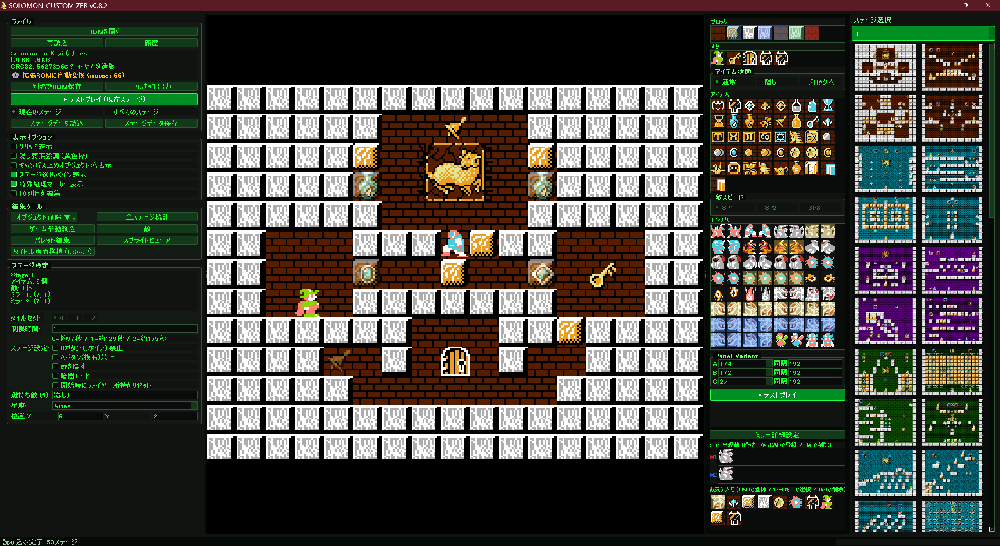

# SOLOMON_CUSTOMIZER 日本語マニュアル

SOLOMON_CUSTOMIZERは、ファミコン版『ソロモンの鍵』の日本版ROMを、ステージ編集の範囲を超えて改造するためのGUIツールです。
日本版ROMを読み込むと、編集用の mapper66 / wide-title 拡張形式へ自動変換し、ステージ配置、敵、部屋ごとの特殊ルール、タイトル画面、パレット、ゲーム挙動、テストプレイ用ROM生成までまとめて扱えます。



## 重要な前提

- このリポジトリにROMデータは含まれません。所有しているROMを読み込んで使ってください。
- 通常の編集対象は、日本版ROMから変換された mapper66 / wide-title 拡張ROMです。
- US ROMは通常編集対象ではありません。タイトル画面移植など、限定的な素材元としてだけ扱います。
- 保存・パッチ出力・テストプレイは、現在の編集状態をROMへ反映してから行います。
- ROMバイナリへ直接書き込む改造は、位置と署名の検証に通った場合だけ適用されます。対応外ROMや破損ROMでは安全に中止します。

## 必要環境と起動

### 配布版が公開されている場合

配布版が公開されている場合は、Releaseページの
`SOLOMON_CUSTOMIZER_vX.X.X_onedir.zip` を展開し、展開後の
`SOLOMON_CUSTOMIZER\SOLOMON_CUSTOMIZER.exe` を起動します。

`_internal` フォルダには実行に必要なライブラリや設定ファイルが入っています。
exeだけを別フォルダへ移動したり、`_internal` を削除したりしないでください。

### ソースから起動する場合

必要環境:

- Python 3.10 以上
- PyQt5

インストール:

```bat
pip install -r requirements.txt
```

起動:

```bat
python SOLOMON_CUSTOMIZER.py
```

ROMを指定して起動:

```bat
python SOLOMON_CUSTOMIZER.py path\to\Solomons_Key.nes
```

`.nes`または`.zip`をウィンドウへドラッグ&ドロップして開くこともできます。

## 基本の流れ

1. `ROMを開く`で所有しているROMを読み込みます。
2. 右側のステージ選択ペイン、またはステージ番号のスピンボックスで編集するステージを選びます。
3. 右のピッカーからブロック、メタ、アイテム、モンスターを選びます。
4. キャンバス上で左クリックして配置、右クリックして削除します。
5. 必要に応じてステージ設定、ミラー詳細、ゲーム挙動改造、パレット編集などを調整します。
6. `テストプレイ`で確認します。
7. `別名でROM保存`または`IPSパッチ出力`で保存します。

## 画面構成

### 中央キャンバス

現在のステージをタイル単位で表示・編集するメイン画面です。
ブロック、アイテム、敵、スタート位置、鍵、扉、ミラー、星座、特殊処理マーカーなどが重ねて表示されます。

ステータスバーには、マウス下のタイル情報や操作結果が表示されます。

### 左ペイン

主な操作ボタンとステージ設定があります。

- `ROMを開く`: ROMまたはZIPを読み込みます。
- `再読込`: 現在のROMを読み直し、未保存の編集を破棄します。
- `履歴`: 最近開いたROMから選びます。
- `別名でROM保存`: 編集済みROMを`.nes`として保存します。
- `IPSパッチ出力`: 元ROMとの差分パッチを`.ips`で出力します。
- `テストプレイ`: 現在ステージから始まる一時ROMを作り、設定済みエミュレータで起動します。
- `ステージデータ読込` / `ステージデータ保存`: PNGに埋め込まれたステージデータを読み書きします。
- `表示オプション`: グリッド、隠し要素強調、オブジェクト名、ステージ選択ペイン、特殊処理マーカー、16列目編集を切り替えます。
- `編集ツール`: 削除、統計、ゲーム挙動改造、敵改造、パレット、スプライトビューア、タイトル画面編集、音楽データ表示を開きます。
- `ステージ設定`: 現在ステージ固有の設定を編集します。

### 右ペイン

配置する要素を選ぶピッカーです。

- `ブロック`: 空白、茶色ブロック、白ブロック、特殊壁などを選びます。
- `メタ`: スタート、鍵、扉、ミラーなどを選びます。
- `アイテム`: 通常アイテム、重要アイテム、特殊アイテムを選びます。
- `モンスター`: 敵を選びます。
- `アイテム状態`: 通常、隠し、ブロック内を切り替えます。
- `敵スピード`: SP1、SP2、SP3を切り替えます。
- `Panel Variant`: パネルモンスターA/B/Cの弾速と発射間隔を現在ステージ用に設定します。
- `テストプレイ`: 左ペインと同じテストプレイを右側から実行できます。
- `ミラー出現敵`: ピッカーからドラッグ&ドロップして、ミラーが出す敵を登録します。
- `お気に入り`: よく使う要素をドラッグ&ドロップで登録します。`1`から`0`キーで呼び出せます。
- ステージ51では、下部がボーナスステージ用の16種アイテム編集パネルに切り替わります。

右端のステージ選択は、現在のステージ番号を直接入力またはスピン操作で切り替えます。
サムネイル一覧を使うと、見た目からステージを選べます。

## マウス操作

| 操作 | 内容 |
|---|---|
| 左クリック | 選択中の要素を配置 |
| 左ドラッグ | 連続配置 |
| 右クリック | そのマスの要素を削除 |
| 右ドラッグ | 連続削除 |
| Ctrl+左ドラッグ | 既存要素をつかんで移動 |
| Shift+左ドラッグ | 範囲選択 |
| Alt+左クリック | スポイト。そのマスの要素をピッカーに取り込む |

右クリック削除は、編集モードに関係なく、そのマスのブロック、アイテム、敵などを削除します。メタ要素や特殊処理由来の表示は、対象によって別操作になります。

右端の16列目は、表示オプションの`16列目を編集`がOFFの時は保護されます。
範囲選択、範囲削除、範囲移動、貼り付け、オブジェクト削除メニューでも同じロックが使われます。

## キーボードショートカット

| キー | 内容 |
|---|---|
| F1 | ショートカットヘルプ |
| F9 | 設定画面 |
| P | テストプレイ |
| PageUp / PageDown | ステージ切替 |
| G | グリッド表示切替 |
| Ctrl+Z | Undo |
| Ctrl+Y / Ctrl+Shift+Z | Redo |
| Delete / Backspace | 選択範囲、またはホバー位置を削除 |
| H | アイテム状態を隠しにする |
| B | アイテム状態をブロック内にする |
| N | アイテム状態を通常にする |
| 1〜9 / 0 | お気に入りスロット選択 |
| Esc | 範囲選択解除 |

範囲編集:

| キー | 内容 |
|---|---|
| Ctrl+C | コピー |
| Ctrl+V | 貼り付け。選択範囲またはホバー位置を起点にします |
| Ctrl+X | 切り取り |
| F | 左右反転 |
| Shift+F | 上下反転 |

左右反転・上下反転は、地形、アイテム、敵、敵の向き、スタート、鍵、扉、星座パネル、ミラー、六芒星などのメタ項目もまとめて反転します。

## ステージ編集

### ブロック

基本のブロック編集です。ピッカーから選んでキャンバスへ置きます。

- 空白
- 茶色ブロック
- 白ブロック
- 壊せる白系、透明壊せる壁、通過可能白壁、透明壁などの拡張ブロック

右端の16列目は、データ上は常に壁として扱われます。通常は編集不可ですが、表示オプションの`16列目を編集`をONにすると編集できます。

### アイテム

アイテムは、配置状態を選んでから置きます。

| 状態 | 内容 |
|---|---|
| 通常 | 最初から見えるアイテム |
| 隠し | 石を作って壊すと出現するアイテム |
| ブロック内 | ブロックを壊すと出現するアイテム |

Warp、Origami Swan、Demonhead Coin、Sphinx、Egyptian Head、Magic Lampなど、一部の特殊アイテムは選択時に隠し扱いへ自動調整されます。

### モンスター

モンスターは通常の配置敵として置けます。対応している敵では`SP1`、`SP2`、`SP3`の速度バリアントを選べます。

Ghost / Neulには、壁衝突時に減速しないnoslow版も登録されています。通常版と並べて選択できます。

敵数は1ステージあたり15体までです。これは拡張ROMでも変わらない、元のROMフォーマット由来の制約です。

強化敵は、通常敵と同じピッカー内に登録されています。黄色系の表示は既存の強化敵、
青系の表示はPanel Variant A/B/Cです。見た目はパネルモンスターですが、内部IDは通常敵の
空き領域を借りているため、ドロップ表など一部の内部分類は元ID側の行を参照します。
これは現行仕様です。

### メタ要素

メタ要素は、ステージの進行や特殊表示に関わる要素です。

- プレイヤースタート位置
- 鍵位置
- 扉位置
- デーモンミラー1 / 2
- 星座パネル
- Pageなどの特殊面用マーカー

Pageマーカーなど一部の特殊位置は、キャンバス上でCtrl+左ドラッグして移動します。内部的にはROM内の特殊処理スクリプト位置を書き換えます。

### 鍵持ち敵

`ステージ設定`の`鍵持ち敵 (#)`で、鍵を持たせる初期配置敵を指定できます。

- `0`: 鍵持ち敵なし
- `1`以降: そのステージの初期配置敵リスト順

敵を削除して指定番号が存在しなくなった場合は、設定が解除されます。

## ステージ設定

左ペインの`ステージ設定`は、現在のステージだけに効く設定です。

### タイルセット

ステージの背景タイルセットを`0`、`1`、`2`から選びます。
星座が設定されているステージでは、星座グループとの整合のためタイルセットが連動・制限されます。

### 制限時間

ステージが使う時間減少テーブルを`0`、`1`、`2`から選びます。
実際の各テーブル値は、`ゲーム挙動改造`側の`ステージ制限時間`で全体設定できます。

### 部屋別ルール

以下のチェックは、現在ステージだけに効きます。

| 項目 | 内容 |
|---|---|
| Bボタン（ファイア）禁止 | その部屋ではBボタンの火球を出せなくします |
| Aボタン(換石)禁止 | その部屋ではAボタンの石生成を無効化します |
| 扉を隠す | 扉を開始前画面や通常状態では見えなくし、石を壊すと出現させます |
| 暗闇モード | プレイ中だけ背景とHUDを明滅で消し、敵とDana中心の暗闇ステージにします |
| 開始時にファイヤー所持をリセット | その面開始時に前の面から持ち越したファイヤー所持を0にします |

A換石禁止は進行不能を作りやすい設定です。石で階段を作る必要がある面では注意してください。

暗闇モードの明るい時間・暗い時間は、全体共通で`ゲーム挙動改造`の`暗闇テンポ`から変更します。

### 星座

星座の種類と表示位置を設定できます。
座標は左上を`(0,0)`とするタイル座標です。

### Panel Variant

右側の`Panel Variant`では、A/B/Cのパネルモンスターごとに、弾速と発射間隔をステージ単位で設定できます。

Panel Variantは、通常パネルモンスターとは別IDの派生パネルモンスターです。
ピッカーでは青系のアイコンで表示されます。

弾速プリセット:

- `1/4`
- `1/2`
- `2x`
- `3x`

間隔はフレーム値です。小さくすると発射頻度が上がります。60フレームがおよそ1秒です。
データが未設定のステージでは、A/B/Cとも間隔`192`が既定値です。

通常パネルモンスター、2WAY、3WAYはこのA/B/C設定を読みません。
通常版の全体的な発射間隔や左右速度バグ修正は、`ゲーム挙動改造`の`パネルモンスター`で扱います。

## デーモンミラー

右ペインの`ミラー出現敵`へモンスターをドラッグ&ドロップすると、ミラーから出現する敵を登録できます。
詳細は`ミラー詳細設定`で編集します。

`ミラー詳細設定`では以下を扱います。

- ミラー1 / 2ごとの出現敵
- Phase 1の出現スケジュール
- Phase 2のループ出現スケジュール
- スケジュール全ON / 全クリア
- スポーン敵の生存時間
- 生存時間のおよその秒数表示

出現スケジュールに1つもチェックがないミラーは、実際には敵を出しません。全ステージ統計でもミラー敵として集計されません。

スケジュールは左から時間経過順です。先頭2tickはゲーム側で無視されるため、表示上チェックがあっても
実際の出現に使われない位置があります。

## ボーナスステージ

ステージ51では、右ペイン下部が`ボーナスステージ アイテム16種`の編集パネルに切り替わります。
ピッカーからドラッグ&ドロップして、ボーナスステージに出るアイテムを入れ替えます。

`ボーナスステージ (ステージ51) 出現位置編集`ダイアログでは、対応する出現位置も編集できます。

## 特殊処理マーカー

一部ステージには、通常のステージデータではなくROM内の特殊処理で出現するブロックやイベントがあります。
表示オプションの`特殊処理マーカー表示`をONにすると、キャンバス上にマーカーとして表示されます。

`特殊処理ビューア`では、各ステージ固有の特殊処理を読込専用で確認できます。

主な表示内容:

- 生バイト
- 擬似アセンブラ
- 注釈
- 壊せる隠しブロック
- 強制クリアなどの特殊イベント
- マイティ・ボムジャックなどの特殊出現

特殊処理ビューアは確認用です。通常のステージ編集とは別の領域なので、直接編集UIはありません。

## ファイル操作と出力

### ROM保存

`別名でROM保存`は、現在の編集内容と各種改造を反映した`.nes`を保存します。
保存したROMは、対応エミュレータで直接実行できます。

ROM保存時には、復元用の補助データも同時に出力します。

- 保存した`.nes`
- 共通設定JSON
- 全ステージのステージデータPNG

元ROMと、共通設定JSON、全ステージPNGがあれば、同じ編集状態を再構成しやすくなります。
ただし現時点では開発中の形式なので、古い版との互換性は保証しません。

### IPSパッチ出力

`IPSパッチ出力`は、元ROMとの差分を`.ips`として出力します。
ROMデータそのものを配布せず、改造差分だけを扱う用途に向きます。

### ステージデータ保存

`ステージデータ保存`は、ステージ画像PNGを出力し、そのPNG内にステージデータXMLを埋め込みます。

左ペインのラジオボタンで範囲を選びます。

- `現在のステージ`: 現在ステージだけを保存
- `すべてのステージ`: `exports/level_01.png`から順に全ステージを保存

PNGは見た目の確認用画像であり、同時に再読込可能なステージデータでもあります。

### ステージデータ読込

`ステージデータ読込`は、PNG内に埋め込まれたステージデータXMLを読み込みます。

- `現在のステージ`: 選んだPNGで現在ステージを上書き
- `すべてのステージ`: フォルダ内の`level_01.png`などをまとめて読み込み

PNGにステージデータが埋め込まれていない場合は読み込めません。

### 共通設定のJSON入出力

`ゲーム挙動改造`ダイアログ内の`共通設定をエクスポート...` / `共通設定をインポート...`で、グローバル改造設定をJSONとして保存・読み込みできます。

インポート前には確認メッセージが出ます。メインパレット、デモ操作、敵ドロップ、
クリア画面メッセージなど一部のROM由来データは、インポート時点で現在の編集ROMへ即時反映され、
Undoでは戻せません。必要な場合は、先に現在の共通設定をエクスポートしておいてください。

## テストプレイ

`テストプレイ`は、現在の編集状態で一時ROMを作成し、現在ステージから開始する形でエミュレータを起動します。
事前に`F9`の設定画面でエミュレータの実行ファイルパスを指定してください。

推奨エミュレータは Mesen です。

左ペインのボタン、右ペインのボタン、または`P`キーから実行できます。
テストプレイ用ROMでは、タイトル画面と開始待ちを短縮するテスト専用処理を追加します。
この短縮処理は通常の`別名でROM保存`には入りません。

主な用途:

- 配置変更後の即時確認
- 現在ステージからの動作確認
- 暗闇、隠し扉、敵AI、弾速、ミラーなどの実機挙動確認

## 全ステージ統計

`全ステージ統計`では、全53ステージの状態を一覧で確認できます。

確認できる主な情報:

- 通常 / 隠し / ブロック内アイテム数
- 敵数
- タイルセット
- 制限時間
- 敵寿命
- 鍵の状態
- 星座
- A禁止、B禁止、暗闇、隠し扉などの部屋フラグ
- 配置敵
- ミラー敵
- 重要アイテム

特徴:

- 配置敵とミラー敵はスプライトで表示されます。
- 重要アイテムはスプライトで横並び表示され、枠色で通常・隠し・ブロック内を見分けられます。
- セルをダブルクリックすると、そのステージへジャンプします。
- `CSV出力`で表をCSV保存できます。
- ウィンドウサイズ、位置、列幅は次回起動時に復元されます。

## パレット編集

`パレット編集`では、背景パレット、スプライトパレット、ステージ壁色を編集できます。

主な機能:

- 背景パレットの編集
- スプライトパレットの編集
- 1〜48面の4面単位壁色編集
- NES 64色からの色選択
- リアルタイムプレビュー
- パレットプリセットの保存・読込
- リセット

ステージ壁色は、4面ごとの壁の基調色を変更します。49面以降の特殊値は通常触りません。

## スプライト/キャラクタービューア

`スプライトビューア`は読込専用の確認ツールです。ROM内グラフィックの見え方を確認できます。

### ROMフレームデータモード

ROMが実際にスプライト描画へ使うフレームデータを抽出して表示します。
エディタ設定にないフレームも確認できるため、通常はこのモードが一番確実です。

変更できる項目:

- CHRバンク
- パレット
- 拡大率

### キャラクターモード

skc_configのメタタイル定義を使い、アイテム、敵、メタなどをキャラクター単位で表示します。

変更できる項目:

- カテゴリ
- タイルセット
- 拡大率

### 生CHRタイルモード

CHR-ROMの8x8タイルをそのまま並べて表示します。
タイル単体ではキャラクターに見えないことが多いので、組み上がった姿はキャラクターモードで確認してください。

変更できる項目:

- バンク
- パレット
- 拡大率
- グリッド線

## タイトル画面移植・編集

`タイトル画面移植 (US↔JP)`では、タイトル画面の移植と編集を行います。
現在の基本方針は、日本版ROMを読み込み、mapper66 / wide-title内部形式へ正規化してから編集する方式です。

できること:

- 別ROMからタイトル画面を移植
- 現在のタイトル画面をプレビュー
- タイトル画面画像を保存
- Top PNG保存
- Top PNG読込
- 追加文字の挿入
- タイトル色編集
- 開いた時点への変更取り消し

移植対象:

- nametable: 配置
- attribute: 色区分
- CHR bank3: 絵

これはIPS適用ではなく、既知のタイトル画面ピースをコピーする処理です。CRC一致は不要です。
データはツールに含めず、所有しているROMから移植します。

### Top PNG保存 / 読込

タイトル上部ロゴなどの画像をPNGとして保存し、画像編集後に読み戻す用途に使います。
取り込みでは配置データを壊さない形でCHRを再構築します。

### 追加文字

タイトル中央付近に1行の文字を追加できます。

使える文字:

- A-Z
- 0-9
- スペース
- `,`
- `.`
- `"`

最大32文字です。

### タイトル色

`タイトル色...`でタイトルパレットを編集できます。NES 64色から選んで調整します。

タイトル編集後は、見た目だけでなくPRG bank1側の配置データも更新されるため、必ずエミュレータで確認してください。

## ゲーム挙動改造

`ゲーム挙動改造`は、ROMの既知アドレスや検証済みフックを書き換えるグローバル設定です。
保存するまではROMファイルへは書き出されません。再読込すれば未保存変更は破棄できます。

項目はカテゴリボタンで表示を絞り込めます。敵関連の詳細設定は、左ペインの`敵`ボタンから開きます。

- 基本
- プレイヤー
- 敵・AI
- 画面・演出
- 保守・特殊

### 基本

| 項目 | 内容 |
|---|---|
| 開始ステージ | ゲーム開始ステージを1〜53面から指定 |
| コンティニュー上限 | コンティニュー可能な上限ステージを変更 |
| ワープ羽 | ワープ羽取得後の進行数を変更 |
| デモプレイのステージ | タイトル放置デモで使うステージを変更 |

デモプレイのステージは、原作の録画入力を別ステージ上で再生する仕組みです。通常プレイには影響しません。

### プレイヤー

| 項目 | 内容 |
|---|---|
| 初期魔法（共通） | 巻物最大数と開始時所持ファイヤーを設定 |
| 初期残数 | 開始時のDana残数を設定 |
| ダーナ歩行速度 | 地上・空中の左右移動速度を倍率で変更 |

初期魔法の入力例:

- 空欄: 原作と同じく所持なし
- `FFF`: 通常ファイヤー3つ
- `SSS`: スーパー3つ
- `FSFS`: 通常とスーパーを混在

### 敵・AI

| 項目 | 内容 |
|---|---|
| 強化サラマンダー（火球発射化） | サラマンダー/ドラゴン共有の攻撃反応距離を変更 |
| パネルモンスター | クールダウン、弾の左右速度バグ修正、修正後速度を設定 |
| ゴーレム | ゴーレム関連の待ちや挙動を調整 |
| ゴーレム/ドラゴン/ガーゴイル歩行速度 | 共有歩行速度を倍率変更 |
| ゴースト＆ヌエル移動速度 | GhostのX方向、NeulのY方向速度を変更 |
| スパークボール移動速度 | 通常/強化スパークボールの速度を変更 |
| 強化スパークボール | LIFE百の位による停止、透明化周期を設定 |
| デーモンヘッド | 反転後の待ちを最小化 |
| ガーゴイル | 検知後・発射直前・復帰待ち、発射後クールダウンを調整 |
| 強化ガーゴイル | 2発目の位置を調整 |
| ドラゴン | 攻撃前の待ちを最小化 |

敵・AI項目は、敵配置そのものではなく、ROM内の挙動テーブルや処理を変更します。影響範囲は全ステージです。

パネルモンスターの`弾の左右速度バグ修正`は、原作の弾速度テーブル由来の左右差を補正する設定です。
同じ弾テーブルを使う敵にも影響する可能性がありますが、原作由来の速度差を直すための全体補正として扱います。

### 画面・演出

| 項目 | 内容 |
|---|---|
| ステージ壁色 | 1〜48面の4面単位壁色を変更 |
| クリア画面のキャラ | THANK YOU DANA画面の左右2体を差し替え |
| 暗闇テンポ | 暗闇ステージの明るい時間・暗い時間を変更 |

暗闇にするかどうかはステージ設定側、テンポはゲーム挙動改造側です。

### 保守・特殊

| 項目 | 内容 |
|---|---|
| 原作バグ回避 | 落下中の横穴侵入が位相依存で不安定になる原作挙動を安定化 |

横穴侵入安定化は、横穴が隣接している時だけ判定を補正します。通常の壁、歩行、ジャンプ、着地は原作どおりです。

### 関連編集

`ゲーム挙動改造`ダイアログ内の関連編集から、以下の補助ダイアログを開けます。

| ボタン | 内容 |
|---|---|
| 敵ドロップ編集 | 敵を炎で倒した時の効果と確率を編集 |
| デモ操作編集 | タイトル放置デモの34ステップ入力を編集 |
| クリア画面メッセージ編集 | クリア画面の3行メッセージを編集 |
| 特殊処理ビューア | ステージ固有特殊処理を確認 |

## 敵ドロップ編集

`敵ドロップ編集`では、敵をDanaの火球で倒した時に出る効果と確率を編集します。

仕組み:

- 10行 x 8枠の表を編集します。
- 確率は、8枠中にその効果が何個入っているかで決まります。
- 1行は複数の敵グループで共有されます。
- `原作に戻す`で復元できます。

注意点:

- ここで扱うのは通常アイテムIDではなく、敵撃破時の効果値です。
- たとえば効果値`$06`は1UPであり、鍵ではありません。
- 敵に鍵や壺などの通常アイテムを直接落とさせる機能ではありません。

## デモ操作編集

`デモ操作編集`では、タイトル画面を放置した時に流れるデモの入力を編集します。

仕様:

- 34ステップ固定
- 各ステップは、入力ボタンと継続フレーム数の組み合わせ
- 60フレームがおよそ1秒
- 録画機能ではなく、原作と同じ形式を手で入力します。
- Start / Selectはデモ中断判定に使われるため選択できません。

最後に死ぬ動きは不要です。見せたい動きを34ステップ内で作れば十分です。

## クリア画面メッセージ編集

`クリア画面メッセージ編集`では、ステージクリア後のメッセージ3行を編集できます。

原作:

- `THANK YOU DANA`
- `YOU RELEASED THIS ROOM`
- `TRY NEXT ROOM`

制限:

- 英大文字A-Zとスペースのみ
- 原作と同じ文字数まで
- 短い分はスペースで埋められます
- JP版専用

安全性のため、表示位置や文字数を伸ばす編集には対応していません。

## 設定画面

`F9`で設定画面を開きます。

| 項目 | 内容 |
|---|---|
| 未保存マーク | タイトルバーに出す未保存表示記号 |
| フォント | アプリ全体のフォント |
| フォントサイズ | 0=デフォルト、任意のpt指定も可能 |
| 太字 | アプリ全体を太字表示 |
| 黒テーマ明度 | 黒基調UIの明るさ |
| アイコン | ウィンドウアイコン画像のパス |
| エミュレータ | テストプレイに使うエミュレータのexeパス |

フォント設定は`適用`で閉じずに確認できます。

## Undo / Redoと未保存表示

編集操作はUndo / Redoできます。
編集があるとタイトルバーに未保存マークが付きます。未保存マークは設定画面で変更できます。

主なUndo対象:

- ブロック、アイテム、敵、メタ配置
- 連続配置や削除
- 範囲編集
- ステージ設定の変更
- オブジェクト削除メニュー

ROM再読込やステージデータ一括読込など、編集状態を大きく切り替える操作ではUndo履歴がリセットされることがあります。

## 対応形式

| 形式 | 用途 |
|---|---|
| `.nes` | 読み込み元ROM、保存済み改造ROM |
| `.zip` | 中のROMを読み込む用途 |
| `.ips` | 差分パッチ出力 |
| `.png` | ステージ画像。ステージデータXMLを埋め込み可能 |
| `.json` | 共通改造設定、パレットプリセットなど |
| `.csv` | 全ステージ統計の出力 |

## 制限事項

- 敵は1ステージ15体までです。
- 特殊処理ビューアは読込専用です。
- ゲーム挙動改造の一部項目は、ROMの版や改造状態によって無効になります。
- US ROMは通常編集対象ではありません。
- タイトル画面編集は実画面への影響が大きいため、保存後に必ずエミュレータで確認してください。
- 共通設定JSONやステージデータPNGは、現行開発版の形式を優先しています。古い版のデータ互換は保証しません。
- Panel Variant A/B/Cは内部IDを借用しているため、敵ドロップなど一部の分類は通常パネルモンスターと完全には一致しません。

## トラブルシューティング

### ROMが読み込めない

Solomon's Keyの対応ROMではない、または対応外リージョンの可能性があります。
ZIPの場合は、中に対象ROMが入っているか確認してください。

### ゲーム挙動改造の項目が無効になる

対象ROMの該当位置や署名が想定と一致していない場合、その項目は安全のため無効になります。
別版ROM、すでに大きく改造されたROM、破損ROMでは起きることがあります。

### テストプレイできない

`F9`の設定画面でエミュレータのパスを設定してください。
Windowsでは、エミュレータの実行ファイル`.exe`を指定します。

### ステージデータPNGが読み込めない

通常の画像PNGにはステージデータが入っていません。
SOLOMON_CUSTOMIZERの`ステージデータ保存`で出力したPNGを使ってください。

### 保存後のROMで挙動が変

まずエミュレータで再現条件を確認してください。
敵AI、弾速、暗闇、隠し扉、タイトル画面などは実機挙動に近い確認が必要です。問題がある場合は、どのROM、どのステージ、どの設定で起きたかを控えてください。

## 参考

SOLOMON_CUSTOMIZERの開発では、過去に作られたソロモンの鍵向け編集・解析ツールから多くの知見を参考にしています。

- BESK（Binary Editor for Solomon's Key）
- skedit
- skchain

これらのツールと作者の方々に感謝します。
