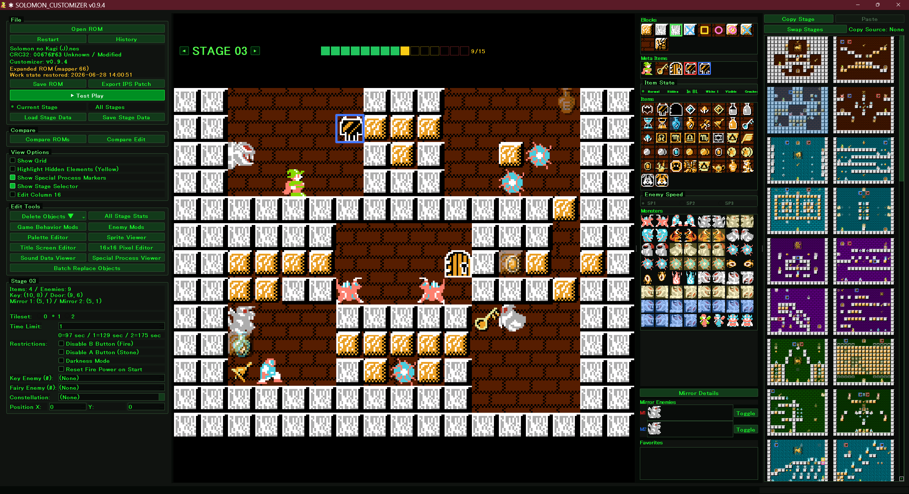
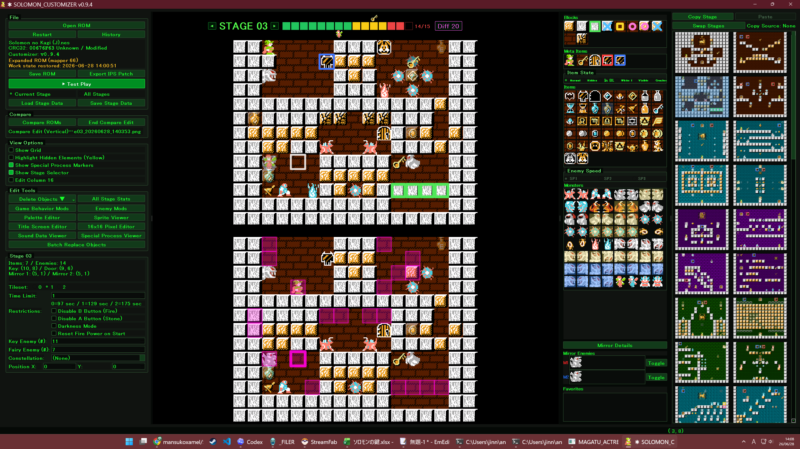
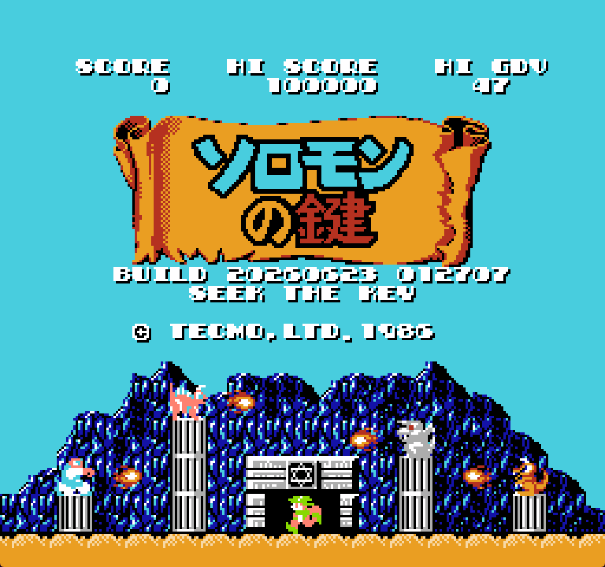
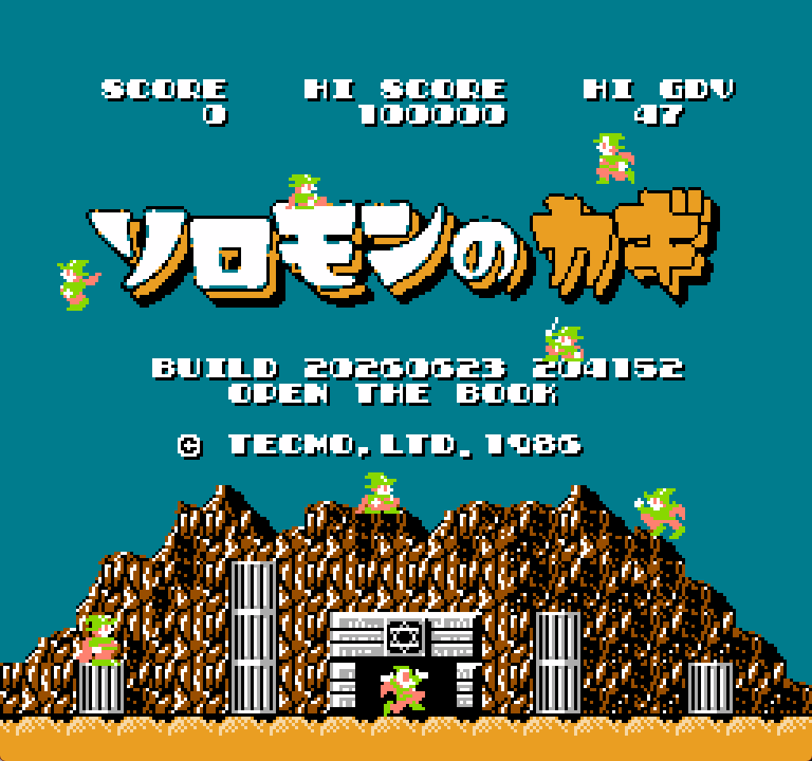

# SOLOMON_CUSTOMIZER

[日本語](#日本語) / [English](#english)

## 日本語

日本のファミコン版とUSのNES版『ソロモンの鍵』を、ステージ編集からゲーム挙動の調整まで扱えるカスタマイザーです。





## 目玉機能

- **ボーナスステージ4つを含む全53面を編集**  
  ブロック、アイテム、敵、鍵、扉、スタート位置、ミラー、星座パネルをGUIで編集できます。

- **6種類の新しいブロックを追加**  
  壊せる/壊せない/すり抜けと、茶色/白/透明の組み合わせを拡張しています。

- **隠し/ブロック内/白ブロック内/透明ブロック内アイテムに対応**  
  状態付きアイテムを見える形で配置できます。

- **ソロモンの封印8個の出現面と場所を編集**  
  分岐条件を守りながら、封印のステージと座標を変更できます。

- **部屋ごとのルールと特殊挙動を編集**  
  換石/魔法禁止、暗闇、隠し扉、扉の透明/ブロック内状態などを設定できます。

- **デーモンミラーを詳細編集**  
  出現敵、出現スケジュール、敵寿命、ミラー反転を編集できます。

- **敵AI・弾速・特殊敵をGUIから調整**  
  強化サラマンダー、強化ガーゴイルA/B、強化スパークボール2種類、強化パネルモンスター3種類を追加できます。

- **ゲーム挙動編集・バグ修正・移動速度変更**  
  敵の移動速度、弾速、敵ドロップ、合鍵を持つ敵、落下死で妖精化する敵を調整できます。

- **タイトル画面の詳細編集**  
  PNG取り込み、タイトルロゴ、配置タイル、16x16色区分、パレット、タイトル上の静止キャラクター配置を編集できます。

  <p>
    
    
  </p>

- **改造ROM差分比較ツール**  
  2つのROM/ZIPを読み込み、面ごとの差分量と詳細差分を確認できます。

- **全ステージ統計と理論得点**  
  アイテム、敵、ミラー敵、部屋フラグ、ブロック内訳、理論得点を一覧できます。

- **現在ステージからすぐテストプレイ**  
  任意の面から始まる一時ROMを作り、そのままエミュレータで確認できます。

- **作業状態の自動保存と復元**  
  元ROM名、保存日時、表示ステージ、Undo/Redo履歴を復元できます。

- **入出力と共有**  
  `.nes`、`.ips`、ステージデータ入り `.png`、共通設定 `.json` などを出力できます。

- **歴代エディターからのステージデータ引き継ぎに対応**  
  既存の改造ROMや旧エディター由来のデータを再編集しやすい形で読み込めます。

## 重要

- このリポジトリにROMデータは含まれません。
- ご自身で所有している日本版またはUS版のオリジナルROMを読み込んで使う前提です。
- 対応原本は日本版（CRC32 `013ED497` / `5B49FEDB` / `2FE9E2CA`）とUS版（CRC32 `B7A00D99` / `99773BC4`）です。US版は、ヘッダーだけが異なりPRG CRC32 `0771C34F`・CHR CRC32 `FAD8A464`が一致する原本も受け付けます。`.nes`を直接開くほか、対象ROMを含む`.zip`も開けます。
- US版オリジナルROMは読み込み時に日本版相当の内部配置へ正規化され、その後は日本版と同じmapper66 / wide-title拡張・編集処理を通ります。
- 『ソロモンの鍵』および関連する名称・画像・ゲーム内容の権利は、テクモ / コーエーテクモゲームスおよび各権利者に帰属します。
- このツールは非公式のファン制作ツールです。権利上の問題や掲載内容への懸念がある場合は、GitHub Issues等でご連絡ください。確認次第、該当内容を修正または削除します。

## 起動

- Python 3.10 以上
- PyQt5

```bat
pip install -r requirements.txt
python SOLOMON_CUSTOMIZER.py
```

### Git版の更新

Gitでこのリポジトリを取得している場合は、`update_from_github.bat` を実行すると `origin/main` を確認し、新しい更新があればfast-forwardで取り込みます。ローカル変更がある場合やブランチが分岐している場合は、自動更新せず停止します。

詳細な操作は [MANUAL.md](MANUAL.md) を参照してください。

## 参考・謝辞

SOLOMON_CUSTOMIZERの開発では、過去に作られたソロモンの鍵向け編集・解析ツールから多くの知見を参考にしています。

- BESK（Binary Editor for Solomon's Key）
- skedit
- skchain

これらのツールと作者の方々に感謝いたします。

## English

SOLOMON_CUSTOMIZER is a customizer for the Japanese Famicom and US NES releases of *Solomon's Key*, covering both stage editing and gameplay behavior tweaks.

### Highlights

- **Edit all 53 rooms, including the 4 bonus stages**  
  Edit blocks, items, enemies, keys, doors, start positions, mirrors, and zodiac panels in the GUI.

- **Adds 6 new block types**  
  Expands block behavior with breakable/unbreakable/pass-through variants across brown/white/transparent styles.

- **Supports hidden, in-block, white-block, and transparent-block items**  
  Place item states that are hard to see or manage in the original game data.

- **Edit the stage and position of all 8 Solomon's Seals**  
  Move seal stages and coordinates while preserving the game's branch conditions.

- **Edit per-room rules and special behavior**  
  Configure stone/magic restrictions, dark rooms, hidden doors, and transparent/in-block door states.

- **Detailed Demon Mirror editing**  
  Edit spawned enemies, spawn schedules, enemy lifetimes, and mirror behavior.

- **Adjust enemy AI, projectile speed, and special enemies**  
  Add enhanced Saramandor, Enhanced Gargoyle A/B, 2 enhanced Spark Ball variants, and 3 enhanced Panel Monster variants.

- **Gameplay behavior edits, bug fixes, and movement speed changes**  
  Adjust enemy movement, projectile speed, enemy drops, key-carrying enemies, and falling-death fairy enemies.

- **Detailed title screen editing**  
  Import PNGs and edit the title logo, background tiles, 16x16 color attributes, palettes, and static title-screen character placement.

  <p>
    
    
  </p>

- **Modified ROM comparison tool**  
  Load two ROM/ZIP files and compare per-stage difference counts and detailed changes.

- **Full-stage statistics and theoretical score totals**  
  List items, enemies, mirror enemies, room flags, block counts, and theoretical scores.

- **Test play from any stage**  
  Create a temporary ROM starting from the chosen stage and launch it in an emulator.

- **Auto-save and work-state restore**  
  Restores the original ROM name, save timestamp, visible stage, and undo/redo history.

- **Export and sharing**  
  Export `.nes`, `.ips`, stage-data `.png`, common settings `.json`, and related data.

- **Import stage data from earlier editors**  
  Load existing modified ROMs and data from older editors for easier re-editing.

### Important

- ROM data is not included in this repository.
- Use this tool with a ROM you own.
- The supported originals are the Japanese release (CRC32 `013ED497` / `5B49FEDB` / `2FE9E2CA`) and US release (CRC32 `B7A00D99` / `99773BC4`). A header-only US variant is also accepted when its PRG CRC32 is `0771C34F` and its CHR CRC32 is `FAD8A464`. Open the `.nes` directly or a `.zip` containing the supported ROM.
- Original Japanese and US ROMs are supported inputs. A verified US original is normalized to the Japanese-equivalent internal layout before the common mapper66 / wide-title editing pipeline runs.
- *Solomon's Key* and related names, images, and game content are owned by Tecmo / Koei Tecmo Games and their respective rights holders.
- This is an unofficial fan-made tool. If any rights holder has concerns about this project or its contents, please contact us through GitHub Issues so the relevant material can be modified or removed.

### Run

Requirements:

- Python 3.10 or later
- PyQt5

```bat
pip install -r requirements.txt
python SOLOMON_CUSTOMIZER.py
```

### Update Git checkout

If this repository was cloned with Git, run `update_from_github.bat` to check `origin/main` and fast-forward to new updates. The script stops without updating when local changes exist or the branch has diverged.

For detailed usage, see [MANUAL.en.md](MANUAL.en.md).

### Credits

SOLOMON_CUSTOMIZER was developed with reference to knowledge from earlier Solomon's Key editing and research tools:

- BESK (Binary Editor for Solomon's Key)
- skedit
- skchain

Many thanks to these tools and their authors.
